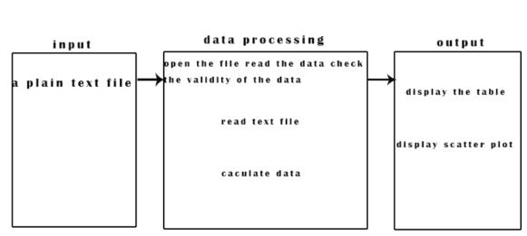
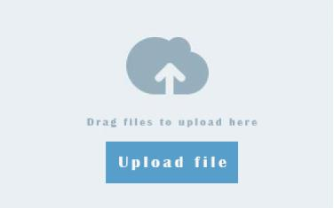

.. hello documentation master file, created by
   sphinx-quickstart on Sun Apr 29 11:38:02 2018.
   You can adapt this file completely to your liking, but it should at least
   contain the root `toctree` directive.

Software Requirements Specification for OMG Version 0.1
=================================

.. toctree::
   :maxdepth: 2
   :caption: Contents:
- **Group name: The North and the South Fatty**
- **Yangjie:1934621564@qq.com (Collect material, draw the picture and write.)**   
- **Huhaiwen:2782983179@qq.com(Collect material,write and write rst)**

+------------------------------------+------------------------+
|         Oh My Genes                |    Version 1.0         | 
|                                    |                        |          
+------------------------------------+------------------------+
|Software Requirements Specification |   Date: 2018.4.28      | 
+------------------------------------+------------------------+
|               OMG SRS 1.0                                   | 
+------------------------------------+------------------------+

1. Introduction 
===============
1.1 Purpose
-----------------
The computer quickly get differentially expressed genes from the gene expression file that scientists 
uploaded To free the scientists from the tedious data calculation, so that they have more energy to engage in 
scientific research, 
so as to improve the experimental efficiency comprehensively.

1.2 Terminology
-----------------
- Transaction Processing

- Data Processing

1.3 Domain knowledge
------------------------

1.3.1 Control sample
~~~~~~~~~~~~~~~~~~~~~~

A cell sample prepared in its normal condition. 

1.3.2 Treatment sample
~~~~~~~~~~~~~~~~~~~~~~
 
A cell sample treated by special chemicals,or in which some genes are altered.

1.3.3 Differentially expressed genes
~~~~~~~~~~~~~~~~~~~~~~~~~~~~~~~~~~~~~
 
The genes which have significantly different expression levels between two samples. 

1.3.4 Up-regulation
~~~~~~~~~~~~~~~~~~~~~~

a gene is said to be up-regulated if it has higher expression in treatment than in control.

1.3.5 logFC
~~~~~~~~~~~~~~~~~~~~~~

log fold change of gene expression.

1.3.6 log_2 [T/C]
~~~~~~~~~~~~~~~~~~~~~~

where T is the gene expression level from a treatment sample, while C is the gene expression level from a control sample.

1.4 Overview
-----------------
The application has a simple interface with only one button. Our scientists uploaded a plain text file containing two samples of gene expression levels representing two experimental conditions. After accepting the document,the software will return a table and the genes differentially expressed genes of scatter plot, the genes of the x axis is the control sample, the y axis is to process the sample. Given an invalid gene expression,the web application will return a page informing the user to provide the correct format.

2.System Definitions
==============================

2.1 Source and background of the project
---------------------------------------------------

The project is an Online Test Genes System for Little Hill Laboratory in Zhejiang. The Laboratory need identifying differentially expressed genes given a gene expression file containing two cell samples, but the process of processing data is complex and takes a long time to get result, so the Laboratory needs a system to ?processing data quickly and  out display the result clearly by scatter diagram and table.

2.2 User characteristics
----------------------------------

- Biologists in our lab

- end-users

- web site maintainers

- Potential user
Student or teacher who study in the field of biological genetics

2.3 Structure of the system
----------------------------------

Based on the description of the user, the system should be divided into two parts: client and server. Client upload gene expression file and then the server read the file to process data. Their relation are described as following: 

2.3.1 data flow diagrams
~~~~~~~~~~~~~~~~~~~~~~~~~~~~~~~~~~~~~~~~~~~~ 

2.2.2 IOP diagram (Input Process Output)
~~~~~~~~~~~~~~~~~~~~~~~~~~~~~~~~~~~~~~~~~~~~~~~~~~~~~~

2.2.3 Screen sketches 
~~~~~~~~~~~~~~~~~~~~~~~~~~~~~~~~~~~~

The application has a simple interface with only one button. Our scientists can upload a plain text file containing two samples of gene expression levels representing two experimental conditions.

3.Running Environment
==============================

The running environment of this project includes hardware environment, software environment and network environment.

3.1 Network Environment
----------------------------------

Users can access this system through the network. Users can upload the file to network and network will response a table of differentially expressed genes and a scatter plot.

.. image:: net.jpg

4.Functional Requirements
==============================

4.1 Data verification 
----------------------------------

First, verify the data format in the plain text document. If the data format is correct, it will be stored in the           database, otherwise the user will be informed to provide the correct format.

4.2 Data processing
----------------------------------

- return a table 
- The genes differentially expressed genes of scatter plot

4.3 Potential functional requirements
----------------------------------------------

- Data storage
According to gene-id, the corresponding genetic data can be saved to facilitate the call and save calculation time. (The gene data may contain the experimental date which Record experimental changes)

- Data modification
Modify the corresponding gene data according to gene-id.

- Data updating
Update the revised data in time. 

- Data Query
To find the corresponding gene data according to gene-id.

- Data security
Make sure the experimental data are not lost and destroyed.

5. Main Use Case Of The System
==============================

5.1 Describe the user case:
----------------------------------------------
Our scientists uploaded a plain text file containing two samples of gene expression levels representing two experimental conditions.System verifies whether the user input an invalid gene expression, if not the web application will return a page informing the user to provide the correct format.System calculates gene expression.System  will return a table of differentially expressed genes and a scatter plot.

6.Exceptions And Handling
==============================

- 6.1 If the user input an invalid gene expression, the web application will return a page informing the user to provide the correct format. 

- 6.2 If you run into an unrecoverable system error, you must also ensure that the database is intact.

7.Non-functional Requirements
==============================

7.1 Response Time
----------------------------------------------

 For critical functions, the system response time should be less than 5 second.

7.2 User Interface
----------------------------------------------

 OMG's user interface design is concise and elegant, the user can according to the mood and personal aesthetic to switch the theme of different style, mostly in the form of simple and comfortable style, interface design is clear, convenient for users to quickly find the corresponding information. All design will be aimed at the user's needs.The web application has a simple interface with only one button [Upload and Go]. Our scientists uploaded a plain text file containing two samples of gene expression levels representing two experimental conditions. After receiving the document, the software will return a table of differentially expressed genes and scatter plots of these genes, whose X-axis is controlled and the Y-axis is treated. Given an invalid gene expression, the web application will return a page informing the user to provide the correct format.

7.3 Confidentiality policy
----------------------------------------------

7.3.1 Authority control
~~~~~~~~~~~~~~~~~~~~~~~~~~~~~~~~~~~~~~~~~~~~~~~~~~~~~~

According to the role of different users, set the appropriate permissions, the important operation of the user to do the corresponding log records for the view, the non privileged user prohibit the use of the system.

7.3.2 Important data encryption
~~~~~~~~~~~~~~~~~~~~~~~~~~~~~~~~~~~~~~~~~~~~~~~~~~~~~~

Some important data are encrypted according to a certain algorithm, such as household registration order, important parameters, etc.

7.3.3 Data backup 
~~~~~~~~~~~~~~~~~~~~~~~~~~~~~~~~~~~~~~~~~~~~~~~~~~~~~~

It allows users to backup and restore data to make up for data damage and loss.

7.3.4 Log log
~~~~~~~~~~~~~~~~~~~~~~~~~~~~~~~~~~~~~~~~~~~~~~~~~~~~~~

This system should be able to record all errors occurred during system operation, including native errors and network errors. These error records are easy to find the cause of the error. Logs also record key operational information of users.

7.3.5 Reduce the risk of privacy disclosure
~~~~~~~~~~~~~~~~~~~~~~~~~~~~~~~~~~~~~~~~~~~~~~~~~~~~~~

In order to prevent unintended actions (such as the "automatic navigation off" command in the field) and the invalid action (a desired "automatic navigation off" command, the failure CSCI must provide security measures.

8.Implementation Constraints
========================================================

- 8.1 Accessible through Firefox, Chrome, and Safari

- 8.2 Web space less than 1GB

- 8.3 Budget less than 10,000 USD

- 8.4 System downtime less than 30 minutes per year

- 8.5 The development cycle is short:It requires the developer to plan the time reasonably and achieve multiple tasks concurrently.

- 8.6 The methods and techniques adopted are limited: the technical level of the project team members is not mature enough, and multiple technologies and capabilities need to be learned in the development.

- 8.7 Time feature: 

There are still some difficulties in ensuring the corresponding speed of the system during peak user time.

- 8.8 Adaptability: 

There may be difficulties in the other operational environment requirements.

9.Change Cases 
==========================================================================================================

Regularly update.Later versions will be running on more browsers(IE5+ ,NS4+,Mozilla,Opera).Its web space will be bigger than before.System downtime will become less and less as the version improves.Technology and methods will become more and more mature.Even the peak of the network can be easily and easily run.

10.Milestones
====================================================

- Submit SRS for review by 3 April 2018

- Get SRS approved by 10 April 2018

- Get design done by 17 April 2018

- Get coding done by 1 June 2018

- Acceptance tests by 15 June 2018

- Release by 29 June 2018

11.References
===================================================

- <<A basic Introduction to Software Engineering>>  -Wenhong Tian 

- <<Software engineering foundation and case analysis>>   -Achuan Wang

- http://web.uvic.ca/~cshen/seng321/project.html

- https://blog.csdn.net/L_chxu/article/details/19899427

- https://wenku.baidu.com/view/4d035e3d9b89680202d82571.html

